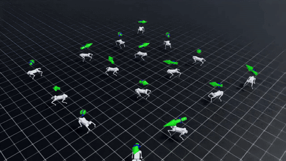
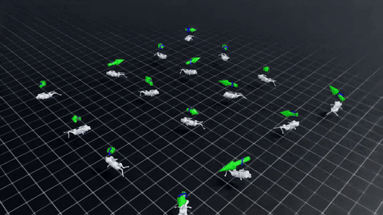
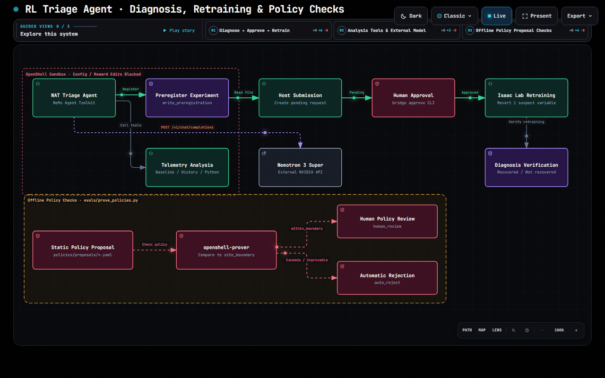

# Isaac Lab RL Training Triage Agent

| Catalog field | Value |
| --- | --- |
| Description | Investigates Isaac Lab RL training failures from telemetry, proposes one next measurement or experiment, and supports human-approved verification inside an OpenShell sandbox. It can compare against a healthy reference or assess a single run without one. |
| Industry | 🤖 Physical AI |
| Requirements | Linux or WSL2 · Docker · OpenShell 0.1.1 · NVIDIA API key (build.nvidia.com) · Isaac Lab 2.1.1 + RTX GPU only for re-running experiments |
| OpenShell | 0.1.1 |
| Collection | Hackathon |

A robot RL engineer changes several settings, trains, and the run collapses. In our own Go2 training ([isaac-walk-rl](https://github.com/mmporong/isaac-walk-rl)), three command-shrinking interventions were rejected in a row (rev28 to rev30), while the same joint-limit symptom had already been recorded 12 days earlier (rev11 Gate01, commit `973769a`, 2026-08-28; attributed in rev31, commit `55159ac`, 2026-09-09). Was it the reward, the actuator scale, exploration noise, PPO settings, physics or termination? This agent reads the training telemetry against a healthy reference run, tests hypotheses with its own analysis code, and hands back **one preregistered experiment** instead of a patched config. A human approves it, the eval bridge retrains in Isaac Lab with only that variable changed, and the result confirms or rejects the diagnosis.

When a healthy reference is unavailable, `configs/triage_single_run.yml` reads one failed run and saves competing hypotheses, measured evidence, limitations and one next measurement. Optional configuration facts are bound to that telemetry by file hashes, and cited configuration values are checked before saving. Its output is marked `hypotheses_only`; it cannot establish normality, recovery or a confirmed cause from that run alone.

> 한국어 요약은 [아래](#한국어-요약)에 있습니다.

## Screenshot

| Healthy reference (checkpoint at 100 iterations) | Injected actuator fault (action scale 0.25 → 1.5) |
|---|---|
|  |  |

Both clips are Isaac Sim 4.5 off-screen renders of trained checkpoints (`bench/record_play.ps1`). The agent never sees video; it reads TensorBoard scalars and optional selected configuration facts. The 100-iteration "healthy" checkpoint stays upright but does not yet follow the commanded velocities: on a fixed 26-command grid its velocity-tracking error equals that of standing still (`bench/protocols/fixed_eval_v1.json`).

## At A Glance

| Question | Answer |
| --- | --- |
| Category | Community Recipe |
| Contributor or provenance | Team Mollet (Korea Agentic AI Hackathon 2026) |
| Use this when | An Isaac Lab RSL-RL training run fails, with or without a known healthy reference |
| You will get | Ranked hypotheses with telemetry evidence and one next measurement or experiment. Reference-based workflows can register an experiment and obtain a verification verdict; single-run assessments are saved under `preregistrations/assessments/<case>.json`. |
| Runs on | Linux or Windows 11 + WSL2 (Ubuntu 24.04) with Docker; Isaac Lab on a Windows or Linux RTX host for retraining |
| Requires | NVIDIA API key for `nvidia/nemotron-3-super-120b-a12b`, OpenShell 0.1.1 gateway, `uv` |
| Verified on | Windows 11 + WSL2 Ubuntu 24.04, Docker 29.8.1, OpenShell 0.1.1, NeMo Agent Toolkit 1.9.0, Isaac Sim 4.5.0 / Isaac Lab 2.1.1, RTX 3060 12 GB |
| Evidence level | live end-to-end |
| Support and maturity | Best-effort community support; hackathon prototype |
| External access, data, and actions | Sends telemetry summaries, selected configuration facts when supplied, and agent messages to `integrate.api.nvidia.com` (NVIDIA API). Tools write assessments, preregistrations and analysis scratch files in the workspace. Approved verification writes evaluation records and new runs under the Isaac Lab log directory. |
| Start here | [Quickstart](#quickstart) |
| Confirm success | [Verification](#verification) |

## How it works

[](https://mmporong.github.io/rl-triage-agent/?view=single-dark)

[Open the interactive diagram](https://mmporong.github.io/rl-triage-agent/?view=single-dark) · [Archify JSON source](docs/diagrams/rl-triage-unified.architecture.json)

The diagram uses English labels and opens on a black background with continuous flow animation. Use Live/Still to pause or resume, click nodes to inspect relationships, and zoom or search. The README preview is an animated GIF; clicking it opens the interactive page.

The default sandbox has no bridge submission tool or access; the host submits the approval request. The lower section shows offline checks by `evals/prove_policies.py`, separately from the agent runtime.

| NVIDIA component | Role here |
|---|---|
| Nemotron 3 Super 120B (build.nvidia.com) | Planning, tool calling, reasoning |
| NeMo Agent Toolkit 1.9 (`nvidia-nat`) | Agent workflows (`configs/*.yml`), 7 reference-based tools (`src/rl_triage/nat_functions.py`) and 5 single-run tools (`src/rl_triage/nat_single_run.py`) |
| OpenShell 0.1.1 | Sandbox image, Landlock filesystem policy, L7 REST network policy, NVIDIA provider (the agent only sees a placeholder key) |
| openshell-prover 0.1.1 | SMT check of every requested permission against `policies/site_boundary.yaml` |
| NVIDIA Skills | `skills-lock.json` (nemo-rl-auto-research, nemoclaw-user-guide, nemotron-policy-generator); own skill `skills/isaaclab-rl-triage` in NVIDIA skill format |
| Isaac Lab 2.1.1 / Isaac Sim 4.5 | Fault-injection benchmark, retraining for verification, recorded clips |

This recipe follows the **OpenShell path** described in the NemoClaw docs ("you use OpenShell as the platform and supply your own container, policy YAML, provider setup"), because the workload is a custom analysis image rather than a NemoClaw reference harness. NemoClaw's current blueprint pins OpenShell 0.0.116, while the prover features used here are in OpenShell 0.1.x. We also tried the NemoClaw path with the Hermes harness on a separate WSL2 distro (NemoClaw installer, OpenShell 0.0.116, `nemohermes onboard --non-interactive`). Onboarding stopped at preflight with `host.platform.wsl_native_docker_unqualified` ("Native Docker Engine inside WSL is not the qualified Docker Desktop integration"), so on this Windows host the NemoClaw path needs Docker Desktop. The skill in `skills/isaaclab-rl-triage` is in NVIDIA skill format for `nemohermes <name> skill install`, but that path is not verified here.

## Results

Benchmark: 10 injected faults (reward, actuator, exploration, optimizer, physics, termination) on `Isaac-Velocity-Flat-Unitree-Go2-v0`, 1024 envs, 100 iterations. Each case mixes 1 harmful and 2 benign hydra overrides, shuffled with a secret seed. Under the original recovery check (episode-length, mean-reward and noise ratios), benign-only runs were recovered and all fault runs were not. That check uses the training reward. A behavior-only check (`evals/results/p0b1_relabel_20261008/`) labels 21 of the 30 fault runs unhealthy, 6 healthy (c03 ×3, c08 ×2, c09 ×1) and 3 undetermined (c01, 1-second episode limit). At 100 iterations even the healthy reference barely follows velocity commands (per-step error 0.72–0.73 m/s, about 0.77 m/s for standing still), so behavior mostly separates falling from not falling. Evaluating every final checkpoint under one fixed condition (`evals/results/p0b2_fixed_eval_20261008/`) gives 15 of 30 fault runs unhealthy; the other 15 leave a policy that stands exactly like the reference. With the Isaac Lab default budget (4096 envs × 300 iterations) the reference does walk (tracking error 0.15 m/s vs 1.18 m/s standing still), so the hidden-fault set below uses that budget.

| Task | Set | RL Triage Agent | Single-prompt Nemotron 3 Super (summary-only input) | Random |
|---|---|---:|---:|---:|
| A. Which change broke it? (change list + telemetry) | dev (seeds 42, 7) | 20/20 | 20/20 | 33% |
| B. Unknown cause: which mechanism? (telemetry only) | dev (seeds 42, 7) | 10/20 (5 truncated at 4096 tokens) | 8/20 | 17% |
| B. Unknown cause | **held-out (seed 123), config v1.1** | **6/10** | 2/10 | 17% |
| B. Unknown cause, top-2 | held-out (seed 123) | 6/10 | 6/10 | 33% |
| A. Which change broke it? | held-out (seed 123) | 10/10 | 10/10 | 33% |

Task A dev: the agent column is the re-run with the OpenAI-compatible client (`evals/results/v1_openai_client/`) after the first NAT `nim` client dropped tool-call responses; the baseline column is the first run (`evals/results/v1_nim_client/`). Every retry in every results file was triggered only by an infrastructure error (overload, empty or truncated response), never by a wrong answer.

On the held-out set the agent was right and the baseline wrong in 4 cases (c01, c04, c05, c07), never the reverse; with n=10 this is not statistically significant (two-sided binomial p≈0.125). Both methods never ranked the true mechanism first for **physics** or **optimizer** faults, on dev or held-out. The baseline tends to answer "reward" from the summary table; the agent pulls the termination and action curves before deciding.

Deterministic baselines without a model (`evals/results/p0a2_holdout_20261008/`), Task B held-out seed 123:

| Baseline | Input | Top-1 | Top-2 |
|---|---|---:|---:|
| Label frequency only (`rule_prior`) | none | 3/10 | 5/10 |
| Fixed rules on normalized telemetry (`rule_features`) | same as the agent | 10/10 | 10/10 |
| Nearest dev case (`rule_template`) | same + dev labels | 10/10 | 10/10 |
| Config diff (`rule_b0`) | failed-run params vs reference | 10/10 | 10/10 |

The rules were written on dev seeds 7 and 42 and committed (`eb318b4`) before they were run on seed 123; the author had seen three seed-123 values quoted in the plan. The held-out seed reuses the same 10 fault templates, and a nearest-neighbour lookup already gets 10/10, so this held-out set tests recognition of known templates, not generalization. We therefore withdraw the claim that the agent diagnoses better than a deterministic rule set on this benchmark. When the failed run's params are visible, all 10 faults are solved by a config diff without a model; new held-out faults must not be explainable by a config diff.

In the first results table the agent reads the full time series with analysis tools, while the single-prompt baseline gets a summary table, so the inputs are not matched. The hidden-fault set below compares methods on the same telemetry.

Hidden-fault held-out set (`evals/results/p0c_holdout_20261009/`, answer key `bench/answer_key_p0c.json`): six faults that change code or runtime state, not the saved config (reward frame, DC-motor curve, sampling noise, frozen critic, runtime friction, early time-out), one per mechanism, trained with the Isaac Lab default budget (4096 envs × 300 iterations) on seeds 2026–2028. All 18 fault runs fail the fixed evaluation; their saved params differ from the reference only by run name. Task B scores (`evals/results/replay_p0c_20261009/`):

| Method | Input | Top-1 | Top-2 |
|---|---|---:|---:|
| Label frequency / config diff | none / params | 3/18 | 6/18 |
| Frozen rules from the first benchmark | telemetry | 5/18 | 9/18 |
| Nearest case from the first benchmark | telemetry + its labels | 6/18 | 6/18 |
| Single prompt, full time series | same telemetry as the agent | 2/18 | 8/18 |
| RL Triage Agent | telemetry + analysis tools | 8/18 | 12/18 |

Six fault types over three seeds is a small sample and the rules came from a different training budget, so this is not a claim of superiority. The agent's analysis code ran under a Linux Landlock sandbox that cannot read the answer key (canary checked before each seed).

Next-experiment loop (`evals/loop.py`, `evals/results/p1a_loop_compare_20261009/`): instead of retraining, the loop proposes one measurement probe at a time (noise, critic learning, reward recomputation, torque saturation, runtime physics, episode length), a human approves it, and the observation rules hypotheses in or out. On the same 18 runs, running all six probes confirms 17; ordering probes from the agent's top-3 hypotheses confirms 14 with 2.1 probes on average and no wrong confirmation. The probes and the hidden faults were written by the same person and the probe definitions were revised four times on a dev seed, so this shows the loop works, not that it generalizes. Each approval runs one probe once; a probe interrupted after approval is closed from its saved output or marked unknown before the next one runs.

The approval loop stores each probe under `evals/results/<tag>/probes/<case>__<probe>.json`. Different probes for the same case have separate outputs; recovery checks the saved output and execution record before closing an interrupted approval.

External-source fault test ([T1 protocol and results](docs/T1-EXTERNAL-FAULTS.md)): three valid held-out pairs were evaluated with a frozen probe set. Two fault runs crossed the preregistered relative tracking-error threshold. All three ended as `none_supported`, with zero wrong confirmations and zero confirmed causes. The probe set left these causes unidentified; these observations do not establish GPU savings.

Live Isaac approval-loop evidence ([records and acceptance limits](docs/LIVE-LOOP-EVIDENCE.md)): eight cases reached terminal states after twelve approved probes; two were confirmed and six were unidentifiable. The result is `accepted=false` because receipt agreement, numerical tolerance and complete cost recording did not all pass. The original failures and interrupted-run records remain available.

No-intervention gate ([T2 protocol and results](docs/T2-NO-INTERVENTION.md)): a standalone offline CLI reads preregistered behavioral evaluation records. All three previously observed healthy development inputs returned `do_not_open_loop`; model calls, probes, approvals and interventions were zero, and existing loop files were unchanged. This gate is not automatically applied by the general loop CLI and has not established generalization to unseen inputs.

Loop verification (`evals/results/bridge_smoke.json`): reverting the true culprit recovered the run (episode-length ratio 0.999, reward ratio 1.024); reverting a benign change did not (0.05). Under the behavior-only check the first run is healthy and the second is undetermined (its 1-second episode limit is still in place), so the wrong diagnosis is not confirmed by retraining.

Security (`evals/results/policy_proofs.json`, `evals/results/sandbox_kernel_tests.txt`):

| Threat | Control | Evidence |
|---|---|---|
| Agent edits configs, joint limits or rewards to pass the gate | No config path in the sandbox filesystem policy; bridge has no config API (405) | kernel test PASS; prover counterexample `PUT /config/` |
| Checkpoint or robot model exfiltration | Only `POST /v1/chat/completions` on `integrate.api.nvidia.com` | kernel test PASS; prover counterexample `huggingface.co:443` |
| GPU retraining abuse | Preregistration required + human CLI approval; no HTTP approval route | `tests/test_security.py` |
| API key leakage | OpenShell provider injects the key at egress; the sandbox sees `openshell:resolve:...` | observed in sandbox run |
| Writing reference data | Landlock read-only; prover returns `unsupported` → fail-closed reject | kernel test PASS |

## Quickstart

```bash
git clone https://github.com/mmporong/rl-triage-agent.git "$HOME/rl-triage-agent"
cd "$HOME/rl-triage-agent"
uv sync
uv run pytest -q tests                                   # unit + app-level security tests
uv run python bench/build_workspace.py 42                # benchmark telemetry + public reference params -> workspace/seed42
export TRIAGE_WORKSPACE=$PWD/workspace/seed42            # tools read this workspace
export NVIDIA_API_KEY=nvapi-...                          # build.nvidia.com
uv run nat run --config_file configs/triage_workflow.yml \
  --input "Triage failed training case_id=c01. Find the root-cause change and register the next experiment."
```

Inside OpenShell (WSL2/Linux with Docker):

```bash
openshell provider profile import -f policies/providers/nvidia.yaml --global
docker build -f docker/Dockerfile.sandbox -t rl-triage-sandbox:0.1 .
bash scripts/sandbox_up.sh 42                            # provider + workspace image + sandbox with policies/triage_agent.yaml
openshell sandbox exec -n rl-triage --env HOME=/tmp -- bash -c 'cd /sandbox/app && nat run --config_file configs/triage_workflow.yml --input "Triage failed training case_id=c03."'
```

Human-approved retraining (Isaac Lab host):

```bash
uv run python -m rl_triage.eval_bridge serve             # agent side can only submit
uv run python -m rl_triage.eval_bridge list              # human
uv run python -m rl_triage.eval_bridge approve <id>      # human: retrain with one variable changed -> verdict
```

### Assess one run without a healthy reference

Prepare a separate workspace containing:

```text
workspace/single_run/
  reference/telemetry.json
  cases/<case_id>/telemetry.json
  cases/<case_id>/configuration.json  # required when context.json is present
  cases/<case_id>/context.json        # optional source hashes and selected facts
```

Set `reference/telemetry.json` to exactly `{"reference_status":"absent","summary":{},"series":{}}`. The case telemetry must contain `summary` and `series` objects. Each summary metric uses `n`, `first`, `last`, `min`, `max`, `mean_first_20pct` and `mean_last_20pct`; each series maps a metric name to its scalar samples. Supply the task context in the input.

To provide reward, observation or sensor definitions, follow [the configuration evidence format](docs/SINGLE-RUN-CONTEXT.md). The tool exposes selected facts, and assessment writing checks source hashes and cited values. Hashes check consistency of the supplied files; they do not authenticate a simulator export. Missing context remains unknown. A configured reward or contact observation does not prove successful behavior or measured contact.

On Linux or WSL2, after the Quickstart installation and API-key setup:

```bash
cd "$HOME/rl-triage-agent"
export TRIAGE_WORKSPACE="$PWD/workspace/single_run"
export TRIAGE_ANALYSIS_SANDBOX=required
uv run nat run --config_file configs/triage_single_run.yml \
  --input "Assess failed run case_id=<case_id>. Task context: <task and observed failure>."
```

The five tools expose configuration evidence, the scalar overview, sampled curves, isolated calculations and assessment writing. Analysis creates `scratch/`; the assessment is saved once to `preregistrations/assessments/<case_id>.json` and an existing assessment is never overwritten. Structured configuration checks do not verify every sentence of an assessment. This workflow makes model API calls but does not start Isaac, retrain or consume an experiment approval. The standalone [T2 gate](docs/T2-NO-INTERVENTION.md) has a separate preregistered execution contract; its existing result tag cannot be reused.

## Verification

**Evidence level:** live end-to-end

```bash
uv run python evals/prove_policies.py
OPENSHELL_SANDBOX=1 python -m pytest -q tests/sandbox    # inside the sandbox
uv run python evals/run_eval.py --task blind --seed 123 --mode both --tag heldout
```

**Expected result:**

```text
triage_agent           result=within_boundary   gate=human_review PASS
bad_exfil_checkpoint   result=exceeds_boundary  gate=auto_reject  PASS
bad_patch_config       result=exceeds_boundary  gate=auto_reject  PASS
bad_write_reference    result=unsupported       gate=auto_reject  PASS
ok_request_eval        result=within_boundary   gate=human_review PASS
8 passed                                                  # tests/sandbox
```

**This verifies:** permission proofs, kernel enforcement inside a live OpenShell sandbox, agent accuracy on recorded Isaac Lab telemetry, and the approve → retrain → verdict loop on a real Isaac Lab run.

**This does not verify:** faults that only appear in long training (>100 iterations), rough terrain, manipulation tasks, real robots, or multi-sandbox fleets.

### Offline replay (no API key, network or GPU)

A clean checkout can recompute the stored scores from public files only. The replay and the workspace builder use the Python standard library; they do not import the model client or NeMo Agent Toolkit.

```bash
python evals/replay.py evals/results/blind_v1 evals/results/heldout_blind evals/results/heldout_changes \
  --traces evals/results/traces             # add --tag <new-folder> to save evals/results/<new-folder>/replay.json
python bench/build_workspace.py 123 --blind # public params from bench/reference/; the blind leak check runs automatically
```

Rule: for each (task, seed, case, mode), the last row with `infra_error: false` counts; a cell with only infrastructure errors counts as wrong. Truth, top-1 and top-2 are recomputed from `bench/answer_key.json` (Task A also `bench/cases.json`), and the replay fails if any stored value differs. `--traces` fails on answer-file or `../..` markers in saved tool calls. Expected:

```text
evals/results/blind_v1: rows=47 infra=7 mismatches=0
  blind    agent         top-1 10/20  top-2 12/20  seeds=7,42
  blind    control       top-1 8/20  top-2 10/20  seeds=7,42
evals/results/heldout_blind: rows=22 infra=2 mismatches=0
  blind    agent         top-1 6/10  top-2 6/10  seeds=123
  blind    control       top-1 2/10  top-2 6/10  seeds=123
evals/results/heldout_changes: rows=22 infra=2 mismatches=0
  changes  agent         top-1 10/10  top-2 10/10  seeds=123
  changes  control       top-1 10/10  top-2 10/10  seeds=123
evals/results/traces: trace files=68 leak hits=0
status=pass
```

Deterministic baselines use the same offline setup. Seeds outside dev 7 and 42 run only when the rule and input files are committed; the output rows rescore with the replay above.

```bash
python evals/baselines.py --seeds 7 42 --out /tmp/p0a2_dev    # or --tag <new-folder>; [--run-params <Isaac Lab log dir>]
python evals/replay.py evals/results/p0a2_holdout_20261008
```

This re-derives past numbers; it is not new performance evidence. Two early files (`evals/results/v1_nim_client/seed42.jsonl`, `evals/results/smoke_c01_seed42.jsonl`) predate the `infra_error` field and are rejected rather than guessed. The leak check covers workspace inputs and saved traces only; agent code in the same checkout can still open `bench/answer_key.json`, so new scored runs need a location without answer files.

## Limitations

- Benchmark circularity: the fault catalog and the agent were built by the same team. Mitigations: benign changes mixed in with a secret seed, prompts committed before each evaluation (`4acb1ed`, `517f613`, `c7e8cd9`), same-model single-prompt baseline, held-out seed.
- Task A saturated: with extreme fault values both the agent and the single-prompt baseline score 20/20. We tried plausible-magnitude changes (v2, `bench/v2/labels.json`); at 100 iterations most did not break training, and a reward-ratio verdict mislabels reward-weight changes, so v2 was not used for scoring.
- The skill's mechanism table (`skills/isaaclab-rl-triage/SKILL.md`) was written after looking at benchmark telemetry; scored runs do not load the skill.
- Network rules apply to child processes, so code run by `run_analysis` can still reach the allowed NVIDIA inference path.
- The NVIDIA free endpoint was often overloaded; the harness retries only infrastructure errors and logs every attempt.

## 한국어 요약

**Isaac Lab 학습 실패 원인 추적 에이전트.** 학습 로그를 읽고 원인 후보와 다음 측정 또는 실험 하나를 제안합니다. 정상 기준 실행이 있으면 텔레메트리를 비교하고 검증 실험을 사전등록합니다. 사람이 승인하면 probe를 실행하거나 재평가 브리지로 변수 하나만 바꿔 다시 학습해 가설을 확인합니다. 정상 기준이 없으면 단일 실행의 수치·가설·한계·다음 측정을 `hypotheses_only` 평가로 저장하며 원인을 확정하지 않습니다. 설정 근거를 제공하면 파일 해시와 인용 값도 대조합니다. 이 검사는 제공된 파일끼리의 일관성을 확인하며, 시뮬레이터에서 나온 자료인지는 인증하지 않습니다.

에이전트는 OpenShell 샌드박스 안에서 설정·안전 게이트·보상을 건드릴 수 없고, 권한 요청은 openshell-prover가 현장 경계와 비교해 증명되지 않으면 자동 거절합니다. 별도 T2 게이트는 사전등록된 행동 평가가 healthy이면 추가 고리를 열지 않습니다. 실제 실행 기록과 실패 판정은 위 결과와 연결된 문서에 보존합니다.
